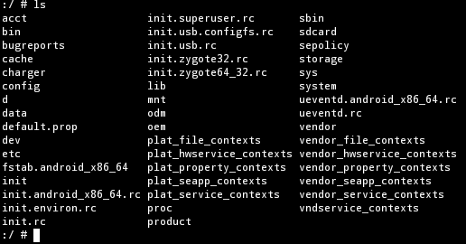

# KUL-739B :: How Android and Linux Systems Are Different


We know that **Android** uses the **Linux kernel**, yet both systems behave very differently—especially when interacting through the command-line interface.

This difference exists because Android and traditional GNU/Linux systems are built with **entirely different userland designs**, even though they share the same kernel.

---

## Basic Differences Observed

1. **Filesystem layout** in Android is different from that of GNU/Linux operating systems (such as Ubuntu, Debian, etc.).
   ```bash
   bin boot dev home lib64 lost+found mnt proc run sbin.usr-is-merged srv sys usr
   cdrom etc lib media opt root sbin snap swapfile tmp var
   ```
   ***info**: Filesystem in linux at **/***

   
   
   ***info**: Filesystem in Android at **/***
   > If you want to see the filesystem in linux and android, use*ls** to see the files and folders. First go to **root** directory, It is done by using command **cd /**.
3. Traditional Linux systems rely on:
   - **glibc**
   - **GNU Core Utilities**
   - Standard filesystem layout (`/etc`, `/home`, `/var`, `/log`)
   - **X11 or Wayland** display servers

4. Android, on the other hand, uses:
   - **Bionic libc**
   - Its own toolchain
   - Android-specific layout (`/system`, `/vendor`, `/data`)
   - No **X11/Wayland** display server
   - A **Java/Kotlin-first runtime (ART)**

5. Preemptive and Dynamic Preemptive models:
   - **Android** uses **FULL PREEMPTION**.
   - As **Mobile Phones** are event-driven systems like we have touch inputs, audio playback, sensors, UI Animations, etc.
   - If **Kernel waits too much**, then the **UI will feel laggy**, **Audio crackles**, **UI Shutters**, **Battery Optimizations Break**.
   -  **Linux** uses **DYNAMIC PREEMPTION**.
   -  As linux is used everywhere, supercomputers, Desktop, Audio Workstation, laptop, so it can adapt to the user's need as **required** that's why it is **DYNAMIC PREEMPTION**.
> Android hardcodes low-latency preemption because user experience depends on it; Linux keeps preemption dynamic because its users and workloads are diverse.

> To see the **Preemption Model** of your linux machine or android device, use command ```uname -a```, you will get output like ```6.14.0-37-generic #37~24.04.1-Ubuntu SMP PREEMPT_DYNAMIC Thu Nov 20 10:25:38 UTC 2 x86_64 x86_64 x86_64 GNU/Linux```, You see that **PREEMPT_DYNAMIC** this is the **PREEMPTION MODEL** of my device.
---

## Key Insight

> A Linux application expects components that **simply do not exist** in Android’s environment.

This is why Linux desktop applications cannot directly run on Android systems without compatibility layers or containerized environments.

---

## References

- Android: https://en.wikipedia.org/wiki/Android_(operating_system)  
- Linux: https://en.wikipedia.org/wiki/Linux  

---

## Materials for Practice

- Download **Android (x86)** from:  
  https://www.android-x86.org/

- Download **Linux distributions** from:  
  https://www.linux.org/pages/download/  
  *(This site conveniently lists most available Linux distributions.)*

---

> You can install both operating systems inside a **virtual machine** and explore their filesystems, process models, and command-line behavior to better understand how they differ in practice.
